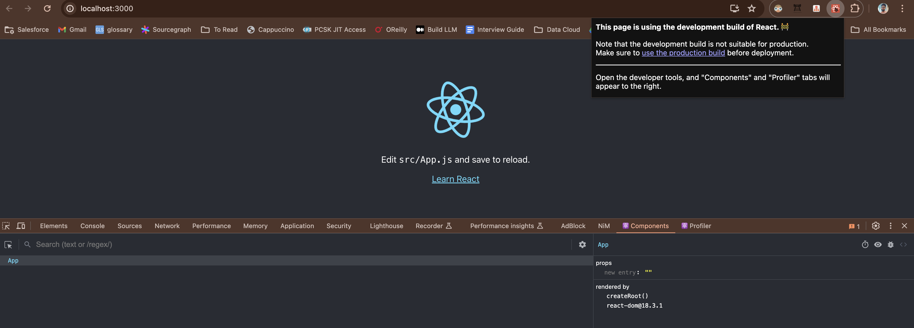
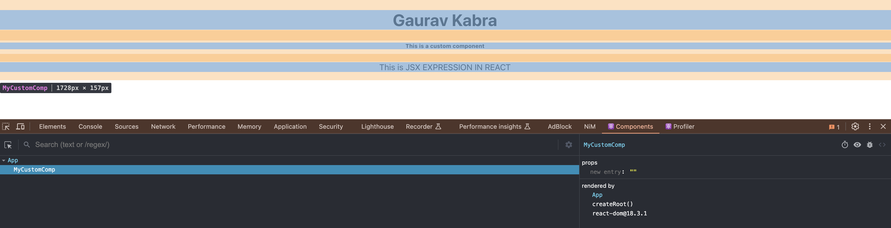
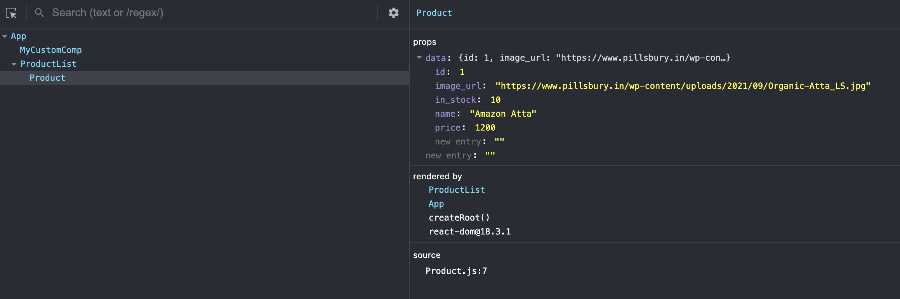
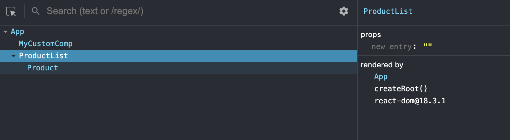

# React
### Installation
- VS Code
- Node
- CRA (Create React App) extension
- React Dev Tools extension or in <a href="https://chromewebstore.google.com/detail/fmkadmapgofadopljbjfkapdkoienihi">Chrome</a>

```
node -v # v20.13.1
npm -v  # 10.5.2
```

Creating react app: `npx create-react-app <app_name>` <br/>
(npx replaces npm -g from npm version 6)

Earlier:
```
npm i create-react-app -g
create-react-app <app_name>
```

---
- Two-way data binding in Angular means changes in the model (data) automatically reflect in the view (UI), and vice versa. In React, it's typically one-way binding, where changes in the model update the view, but changes in the view don't automatically update the model; they usually require explicit handling.
---

### Notes
- Angular is framework, React is a lib. Angular relies on two-way data binding, whereas React relies on one-way data binding. Angular relies on zones but React relies on virtual DOM
- Components in React are just like HTML tags 
- Virtual DOM : Traditionally, all records are updated (even unchanged ones, as can be seen from Dev Console -> Elements -> highlighting blink). So in React, clone is created with latest values and then only diff is rendered (reconciliation). And clone is created only once and then incrementally changed. E.g. applying filters on Amazon will result in some results already on UI
- `ReactDOM` is virtual DOM in React and it builds by finding element with ID `root` (see `index.js`). So as soon as we change outside virtual DOM, React cannot help
`document.getElement...` will give JS DOM, not React's DOM. Use `useRef()` instead
- We can write HTML in React code and hence called JSX
- Redux is state management in JS and since React does not have one, Redux is used

#### Using React Dev Tools

In production build, src code gets minified. For prod, use `npm run build`

## Components
###### Conventions
1. One compoenent in one file
2. Name of file should be same as name of component
3. Name of component should be in PascalCase
4. Every component returns, and only one HTML tag which is rendered on UI
5. `App` contains everything

#### Creating custom component:
```
import React from 'react';

function MyCustomComp() {
    return (
        <>
            <h1>Gaurav Kabra</h1>
            <h6>This is a custom component</h6>
            <p>This is {"JSX Expression in React".toUpperCase()}</p>
        </>
    )
}

export default MyCustomComp;
```
Note that adjacent HTML tags must have one wrapper parent tag (here `<>`).

And in `App.js`:
```
import MyCustomComp from './components/MyCustomComp';

// some code

return (
    <div className="App">
        <MyCustomComp/>
    </div>
);
```



### Communication
1. Communication always happens Parent <=> Child. So, parent cannot talk directly to grandchild or vice-versa.
2. Parent to child: props (properties)
3. Child to parent: props (events)
Parent:
```
function ProductList() {
    const data = {
        id: 1,
        name: 'Amazon Atta',
        price: 1200,
        image_url: "https://www.pillsbury.in/wp-content/uploads/2021/09/Organic-Atta_LS.jpg",
        in_stock: 10,
    };

    return (
        <div>
            <Product data={data}
                     btnClick={() => alert('gaurav kabra')}/>
        </div>
    )
}
```

Child:
```
function Product(props) {
    const data = props.data;
    return (
        <div>
            
            <h5>{data.name}</h5>
            <h5>{data.price}</h5>
            <h5>{data.in_stock}</h5>
            <button onClick={() => props.btnClick()}>Add to cart</button>
        </div>
    );
}
```
Only Product has props,



<br/><br/><br/>

`Warning: Each child in a list should have a unique "key" prop.`
<br/>
`key` is required for efficient rendering (performance) when dealing with list of objects
```
function ProductList() {
    const data = [{
        id: 1,
        name: 'Amazon Atta',
        price: 1200,
        image_url: "https://www.pillsbury.in/wp-content/uploads/2021/09/Organic-Atta_LS.jpg",
        in_stock: 10,
    }, {
        id: 2,
        name: 'Amazon Soap',
        price: 200,
        image_url: "https://www.jiomart.com/images/product/original/490915879/lux-fresh-splash-bar-soap-with-cooling-mint-water-lily-150-g-pack-of-3-product-images-o490915879-p490915879-0-202301201903.jpg?im=Resize=(420,420)",
        in_stock: 5,
    }];

    return (
        <div> 
            {
                data.map(item => <Product data={item}
                                            btnClick={() => alert('gaurav kabra')}
                                            key={item.id}/>)
            }
        </div>
    )
}
```
Caution:
NEVER use list indexes as keys. Say item `A` had index 0 initially, user applied filter and in new result, `A` now has index 1. If index were used as keys, React will re-render `A` which is not desired. <br/>

## useState
1. UI updates happen through states (stateful components)
2. State should always be initialized
3. State should be updated immutabily, else no re-rendering happens

Below does not re-render (stateless):
```
let data = [];
getProducts()
    .then(res => {
        console.log(res);
        data = res.data;
    })
    .catch(ex => alert(ex));

return (
    <div> 
        {
            data.map(item => <Product data={item}
                                        btnClick={() => alert('gaurav kabra')}
                                        key={item.productId}/>)
        }
    </div>
)
```

Below will (`useState` is a built-in hook to make stateful):
```
import { useState } from 'react';

// some code

function ProductList() {
    let [data, setData] = useState([]);
    
    getProducts()
        .then(res => {
            console.log(res);
            setData(res.data);
        })
        .catch(ex => alert(ex));

    return (
        <div> 
            {
                data.map(item => <Product data={item}
                                            btnClick={() => alert('gaurav kabra')}
                                            key={item.productId}/>)
            }
        </div>
    )
}
```
### useEffect
But problem is it will make web call then again on re-rendering execute whole code and again and again... (Network tab infinite calls). See [Network Tab Rec](./assets/videos/no_use_effect.mov)

Using `useEffect` lifecycle is managed:
```
Mounting:
ctor()
render()
componentDidMount()

Updating:
render()

Unmounting:
render()
```
1. Mounting - data fetch, first render (Note that we need `{}` after `() =>`, else it will unmount)
```
useEffect(() => {
        // executed only once
    }, []
)
```
2. Updating - 
```
useEffect(() => {
        // executed whenever state/props changes
    }, [state, props]
)
```
3. Unmounting
```
useEffect(() => {
    return () => {
        // unload
        }
    }, []
)
```

`useEffect` hook takes 2 args - effect func and dependency on which func is invoked. Can have multiple `useEffect` implementations

## Class Based Components
We have one more way to mitigate infinite calls - using Class based component. Only logic written in `render()` is executed again and again. Also, `state` is natively available.

A component returns a UI comp, but a hook returns a data element.

## Pure Component
When user selects a location (say Hyd) in BookMyShow and tries changing it but again clicks on Hyd, ideally re-rendering should not happen but in below code it will happen even if we change A => A and B => B.
```
class MyCustomPureComp extends React.Component {
    state = {location: "hyd"};

    render() {
        console.log("I am re-rendering");
        return (
            <div>
                <p>{this.state.location}</p>
                <button onClick={() => this.setState({location: "hyd"})}>hyd</button>
                <button onClick={() => this.setState({location: "blr"})}>blr</button>
            </div>
        );
    }
}
```

So we use PureComponent, rest all will be same
```
class MyCustomPureComp extends React.PureComponent {
    ...
}
```
Functional components are by-default pure components. We can however make it pure using `Component` as well using `shouldComponentUpdate` method:
```
class MyCustomCompToBePure extends React.Component {
    state = {location: "hyd", count: 0};

    shouldComponentUpdate(nextProps, nextState) {
        return this.state.location !== nextState.location 
            || this.state.count === 5;
    }

    render() {
        console.log("I am re-rendering");
        return (
            <div>
                <p>{this.state.location}</p>
                {this.state.count >= 5 ? <p>Count &gt;= 5 </p> : null}
                <button onClick={() => this.setState({count: this.state.count+1})}>Increase count</button>
                <button onClick={() => this.setState({location: "hyd"})}>hyd</button>
                <button onClick={() => this.setState({location: "blr"})}>blr</button>
            </div>
        );
    }
}
```

Note that `shouldComponentUpdate` method should not be used with `PureComponent` to avoid perf issue (since two logics - your and built-in will start executing, leading perf issue).

## Error Boundary
Error in one component should not affect another. Error boundary is only possible with Class component. <br/>
By default, if a component throws error, React removes it from UI silently. Wrap it in error boundary to have a fallback UI. <br/>
Works only in prod. In development mode, it will still crash.


## Event
```
function Checkout() {
    const [name, setName] = useState('');
    const emailRef = useRef();

    const saveData = (evt) => {
        evt.preventDefault();       // prevents refresh on submit - the default behaviour
        console.log('saved data', name, emailRef.current.value);
    }

    return(
        <form onSubmit={(evt) => saveData(evt)}>
            {/* controlled way */}
            <input placeholder="name" onChange={(evt) => setName(evt.target.value)}/>
            {/* un-controlled way */}
            <input placeholder="email" ref={emailRef}/>
            <button type="submit">Submit</button>
        </form>
    );
}
```
Note: Controlled is preferred since form values and validations are easier in that way.